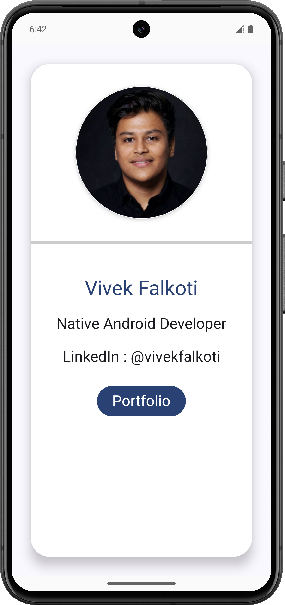

# JetBizCard

A modern Android Business Card application built using **Kotlin**, **Jetpack Compose**, and **Material Design 3**.

---

## Project Preview



---

## Badges


---

## About

JetBizCard is a simple portfolio-style Android application created while learning Jetpack Compose.

### Features

* Circular Profile Image
* Business Card Layout
* Developer Information
* Portfolio Button
* Material Design 3 UI
* Compose-based Architecture

---

## Tech Stack

* Kotlin
* Jetpack Compose
* Material Design 3
* Android Studio
* Git & GitHub

---

## Learning Outcomes

Through this project, I learned:

* Building UI with Jetpack Compose
* Working with Material 3 Components
* Using Cards, Surfaces, Images, and Buttons
* Compose Layouts and Modifiers
* Git & GitHub Workflow

---

## Clone Repository

```bash
git clone https://github.com/vivekfalkoti/JetBizCard.git
```

---

## Developer

**Vivek Falkoti**

GitHub: https://github.com/vivekfalkoti
